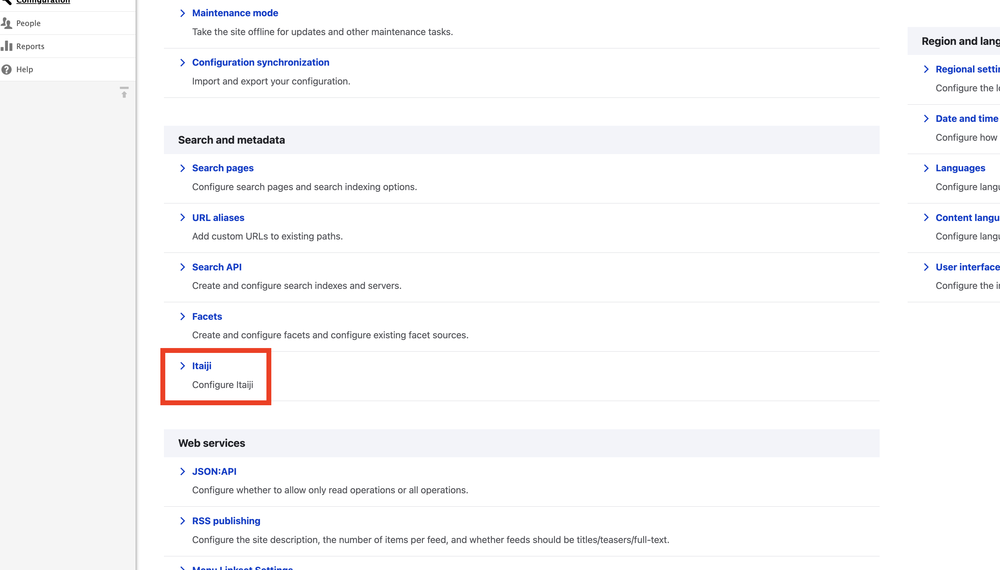
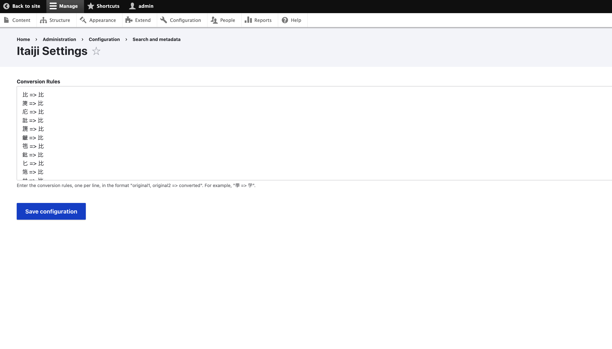
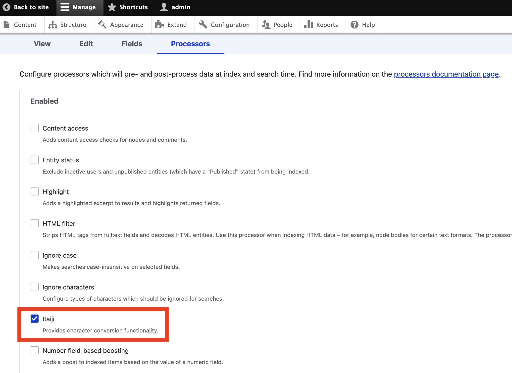

# Itaiji

Provides character conversion functionality.

## Usage

### Configuration

/admin/config

/admin/config/itaiji

Enter the conversion rules, one per line, in the format "original1, original2 => converted". For example, "學 => 学".

### Search API

/admin/config/search/search-api/index/{INDEX_NAME}/processors

